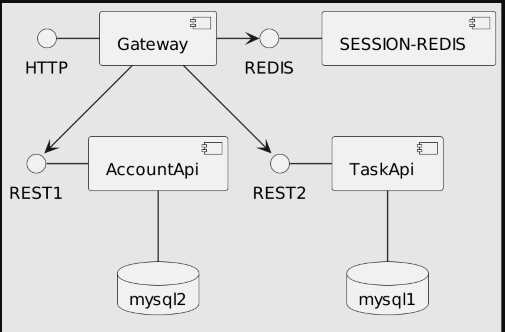
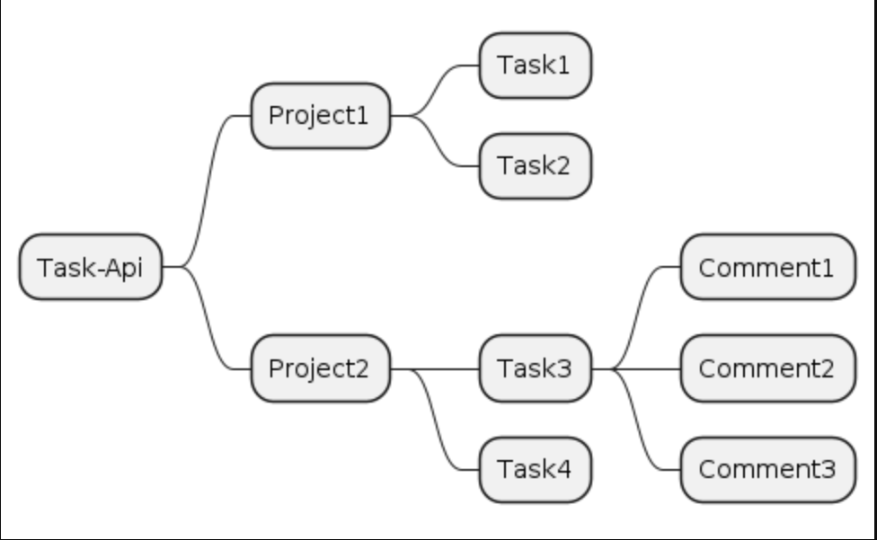

# Task - API

- 사용자는 Project 를 생성할 수 있습니다.
    - Project를 생성한 사용자는 Project 의 관리자 입니다.
    - Project는 프로젝트 이름, 상태(활성, 휴면, 종료) 를 가집니다.
- Project 관리자는 멤버를 등록할 수 있습니다.
    - Project 멤버는 회원관리에서 가입한 회원만 가능합니다.
- Project 멤버는 Task 를 등록, 수정, 삭제 할 수 있습니다.
- Project 멤버는 Task 의 목록 및 내용을 확인 할 수 있습니다.
- Project 멤버는 Project 에 Tag, MileStone 을 등록, 수정, 삭제 할 수 있습니다.
- Project 에 등록한 Tag, MileStone 을 Task에 설정 할 수 있습니다.
    - Tag : Task 에 설정할 속성입니다. Task에 1개이상의 Tag 를 설정할 수 있습니다.
    - MileStone : Project 진척 상황을 나타내는 이정표입니다. Task 에 한개의 MileStone 을 설정할 수 있습니다.
- Project 멤버는 Task 에 Comment 를 생성할 수 있습니다.
- Comment 를 생성한 사용자는 Comment 를 수정, 삭제 할 수 있습니다.
- Task-Api, Project, Task, Comment 의 구조는 다음과 같습니다.

---

## 기술 목록

- Spring Boot
- Spring Data JPA
- MySql

## Note

